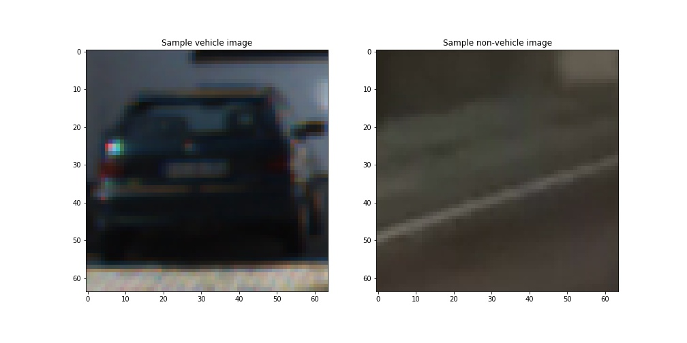
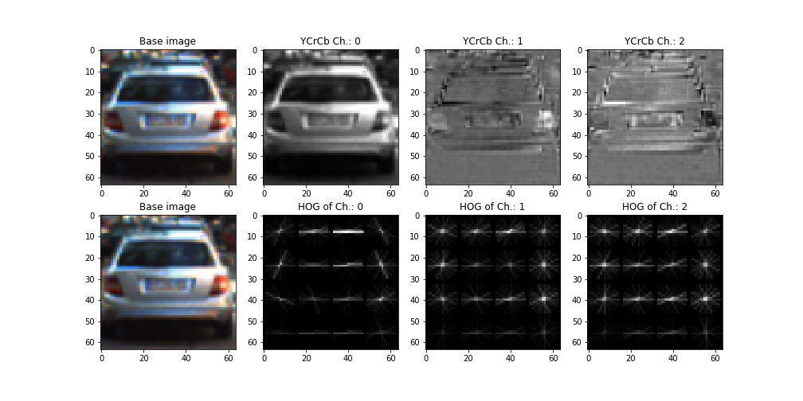
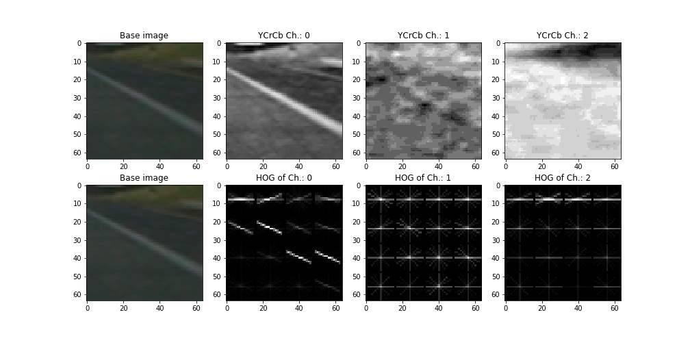
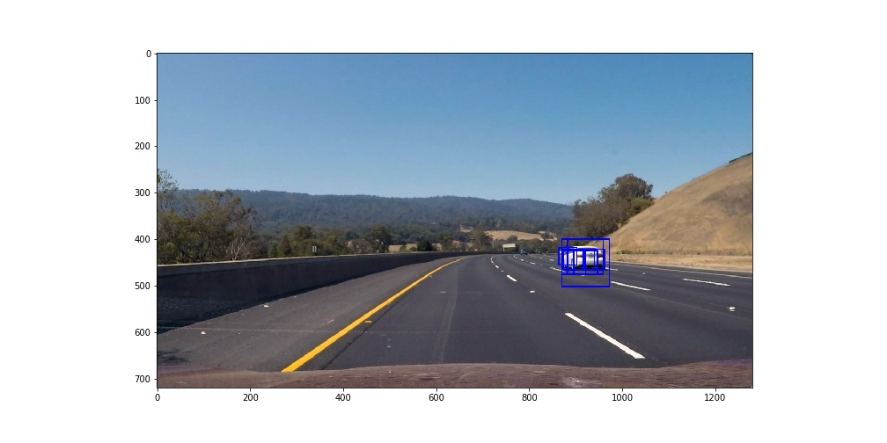
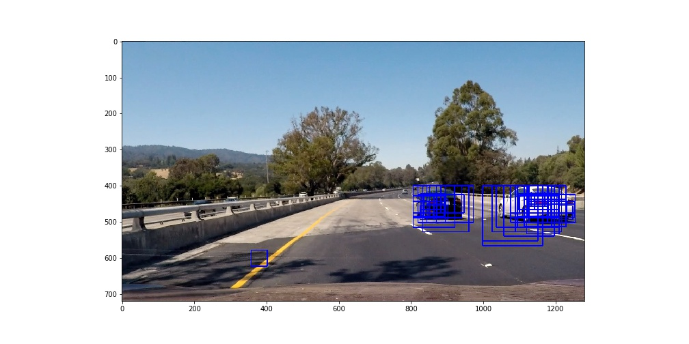
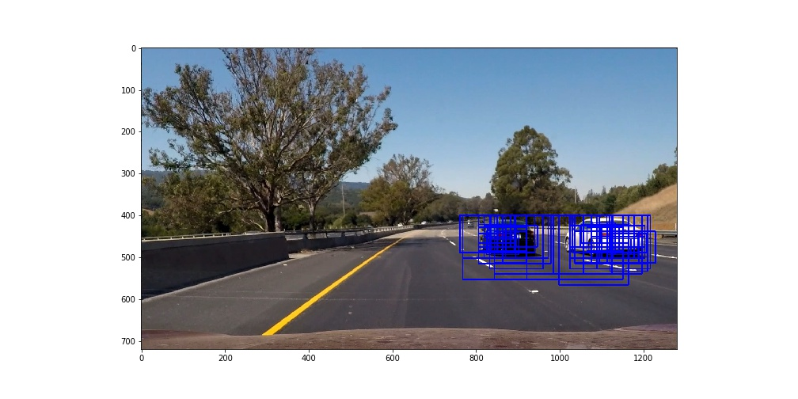
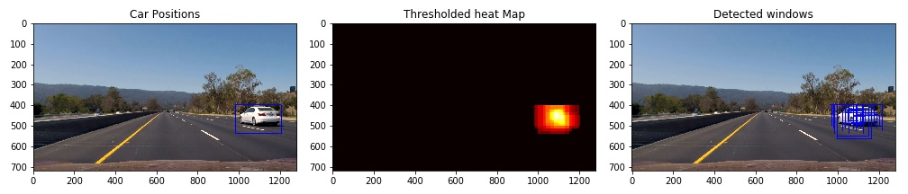

# Project 5: Vehicle Detection

The goals / steps of this project are the following:

* Perform a Histogram of Oriented Gradients (HOG) feature extraction on a labeled training set of images and train a classifier Linear SVM classifier
* Optionally, you can also apply a color transform and append binned color features, as well as histograms of color, to your HOG feature vector. 
* Note: for those first two steps don't forget to normalize your features and randomize a selection for training and testing.
* Implement a sliding-window technique and use your trained classifier to search for vehicles in images.
* Run your pipeline on a video stream (start with the test_video.mp4 and later implement on full project_video.mp4) and create a heat map of recurring detections frame by frame to reject outliers and follow detected vehicles.
* Estimate a bounding box for vehicles detected.

**Note:** Any code discussed in the following sections can be found in the accompanying p5_vehicle_detection_and_tracking.ipynb Jupyter Notebook under a section annotated with the same section numbers as below.

## [Rubric](https://review.udacity.com/#!/rubrics/513/view) Points
### Here I will consider the rubric points individually and describe how I addressed each point in my implementation.  

---
### A. Writeup / README

#### A.1. Provide a Writeup / README that includes all the rubric points and how you addressed each one.  You can submit your writeup as markdown or pdf.  [Here](https://github.com/udacity/CarND-Vehicle-Detection/blob/master/writeup_template.md) is a template writeup for this project you can use as a guide and a starting point.  

You're reading it!

### B. Histogram of Oriented Gradients (HOG)

#### B.1. Explain how (and identify where in your code) you extracted HOG features from the training images. And explain how you settled on your final choice of HOG parameters.

I started by reading in all the `vehicle` and `non-vehicle` images.  Here is an example of one of each of the `vehicle` and `non-vehicle` classes:

I then explored different color spaces and different `skimage.hog()` parameters (`orientations`, `pixels_per_cell`, and `cells_per_block`).  I grabbed random images from each of the two classes and displayed them to get a feel for what the `skimage.hog()` output looks like.

The `get_hog_features()` function can be used to extract HOG features from a multichannel image. It in turn calls `get_hog_features_1ch()` to extract HOG features from a single channel.

I tried various combinations of parameters and finally settled on the following params...

HOG_COLOR_SPACE = 'YCrCb'
ORIENTATIONS = 32
PIXELS_PER_CELL = 16
CELLS_PER_BLOCK = 2
HOG_CHANNELS = "ALL"

Here is an example using the `YCrCb` color space and above given HOG parameters:

Though just using HOG features was not enough to breach the 98% accuracy level. So in addition to the above I used a scaled down version of the training image (`bin_spatial()`) and color histograms (`color_hist()`) to increase the recognition accuracy beyond 99%. The individual feature extraction procedures were finally put togther in `extract_features()`.

#### B.2. Describe how (and identify where in your code) you trained a classifier using your selected HOG features (and color features if you used them).

1. Extracted feature data from the training images and scaled them using `sklearn.preprocessing.RobustScaler` so that it has zero mean and unit variance.
2. Then split the training data into two sets while maintaining a 80:20 ratio. 
3. 80% of the randomly selected images were used to fit a `sklearn.svm.LinearSVC()` classifier based model.
4. The remaining images were used to test the accuracy of the model. The model achieved an accuracy of ~99% on the randomly selected test images.

### C. Sliding Window Search

#### C.1. Describe how (and identify where in your code) you implemented a sliding window search. How did you decide what scales to search and how much to overlap windows?

The sliding window search was implemented in `find_cars()`. In this method the frame was sub-divided into rectangular windows over which all the features needed to run the classifier were extracted.

The scale values were determined experimentally to maximize the chance of detection as the vehicle sizes change due to their current relative distance from the camera. I used a value of two cells per step of the sliding window operation to create overlapping windows.

#### C.2. Show some examples of test images to demonstrate how your pipeline is working.  What did you do to optimize the performance of your classifier?

As an optimization the HOG features were computed over the entire frame just once and cached for later use. The sliding window coordinates were used to extract the required HOG features from the cached matrix of HOG values. This sped up the detection process significantly.

Ultimately I searched on 12 scales using YCrCb 3-channel HOG features plus spatially binned color and histograms of color in the feature vector, which provided a nice result. Here are some example images:

---

### D. Video Implementation

#### D.1. Provide a link to your final video output.  Your pipeline should perform reasonably well on the entire project video (somewhat wobbly or unstable bounding boxes are ok as long as you are identifying the vehicles most of the time with minimal false positives.)
Here's a [link to my video result](output_videos/project_video_annotated.mp4)

#### D.2. Describe how (and identify where in your code) you implemented some kind of filter for false positives and some method for combining overlapping bounding boxes.

I recorded the positions of positive detections in each frame of the video.  From the positive detections I created a heatmap and then thresholded that map to identify vehicle positions.  I then used `scipy.ndimage.measurements.label()` to identify individual blobs in the heatmap.  I then assumed each blob corresponded to a vehicle.  I constructed bounding boxes to cover the area of each blob detected.  

Here's an example result showing the heatmap from a series of frames of video, the result of `scipy.ndimage.measurements.label()` and the bounding boxes then overlaid on the frame...

##### Here are a few frames their with final bounding boxes, thresholded heatmaps and activated sliding windows

---

### E. Discussion

#### E.1. Briefly discuss any problems / issues you faced in your implementation of this project.  Where will your pipeline likely fail?  What could you do to make it more robust?

##### Problems faced
- I faced several issues due to mismatched quantities...
    - I used different scalers during training and actual use (prediction).
    - Used image pixel values with differing pixel values ([0-1] vs [0-255]) and BGR vs RGB.
    - Computed the color histogram and image sub sampling on the raw frame instead of the color space converted image.

- The model produces a lot of false positives. I would have liked to retrain it using the incorrectly identified segments if I had some more time. If I went ahead with this I would have had to create a new app for labeling the failing cases. For the time being the heatmapping solution removes a lot of these mis-detections (but still misses out a few).

##### Failure modes and possible fixes
- Unfortunately it seems the HOG + sliding windows mechanism needs a lot of computational power just to do a good enough job. It may be a better idea to use a CNN (convolutional neural network) instead, especially since neural networks are more amenable to GPU processing.
